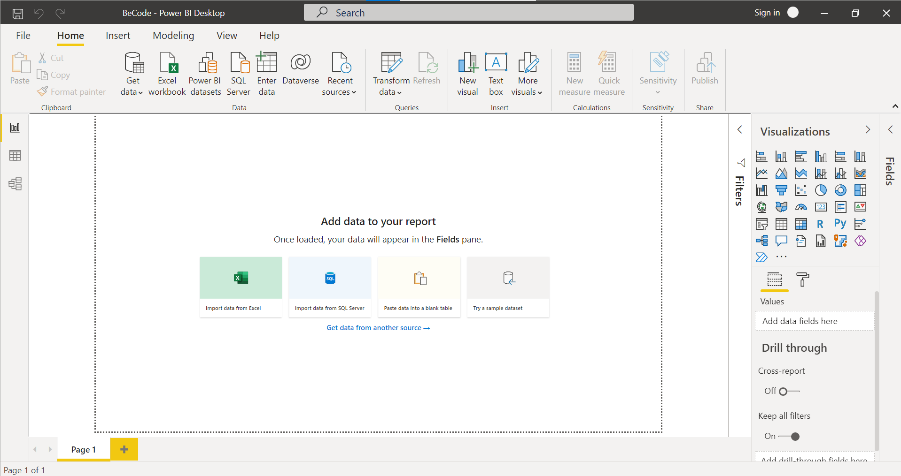
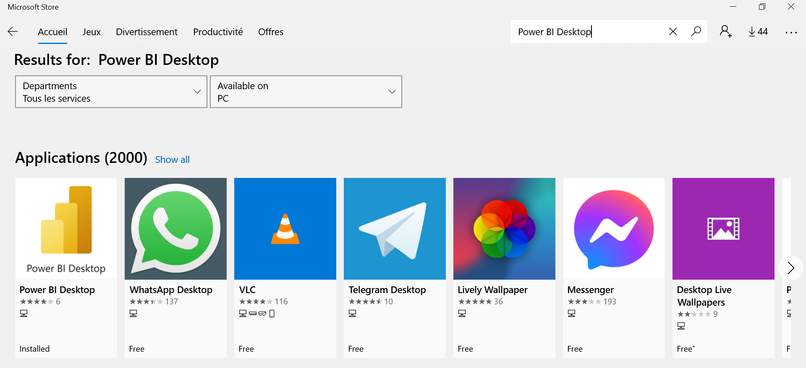
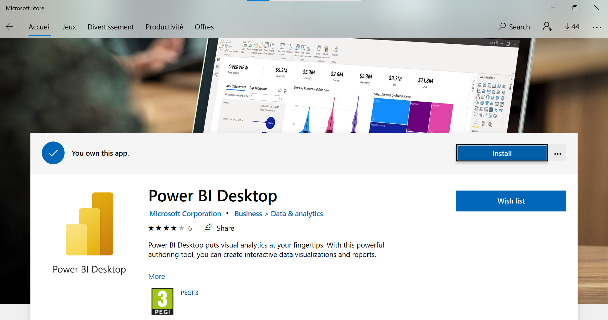
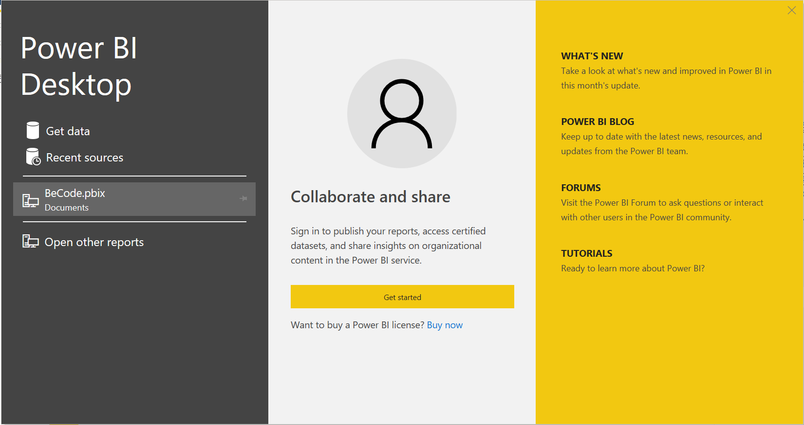

# Introduction

## What is Power BI?

Data visualization and reporting are tasks on the work of a Data Scientist, Power BI helps you to create dashboards to provide insights and build the story-telling around your data. 

***"Power BI is a Microsoft business analytics service. It provides interactive visualizations and business intelligence capabilities with an interface that Microsoft says is simple enough for end users to create reports and dashboards"*** [Read more](https://en.wikipedia.org/wiki/Microsoft_Power_BI)

[Official docs](https://docs.microsoft.com/en-us/power-bi/fundamentals/desktop-getting-started)

[Videos: Learning Power BI](https://docs.microsoft.com/en-us/learn/powerplatform/power-bi?WT.mc_id=sitertzn_learntab_guidedlearning-card-powerbi)

## Installing Power BI Desktop

Requirements:

- **OS**: Windows 8.1 or above
- **Memory (RAM)**: At least 2 GB available, 4 GB or more recommended.

1. Go to Microsoft Store and search for `Power Bi Desktop`

2. Install  `Power Bi Desktop`

After a few minutes, you will be ready to start and use the application.

*Now the real fun is about to start.* 😁

## Data Sources For PowerBI

There a wide variety of data sources to be used with PowerBI. You can take a look at all the available sources [here](https://learn.microsoft.com/en-us/power-bi/connect-data/power-bi-data-sources).

Follow the following tutorials to learn how to connect to some of the most common data sources:

* [PowerBI Data Sources](https://www.proserveit.com/blog/power-bi-data-sources)
* [SQL with PowerBI](https://www.datacamp.com/tutorial/sql-with-powerbi)

# [Next Step](./02.Getting_started.md)
