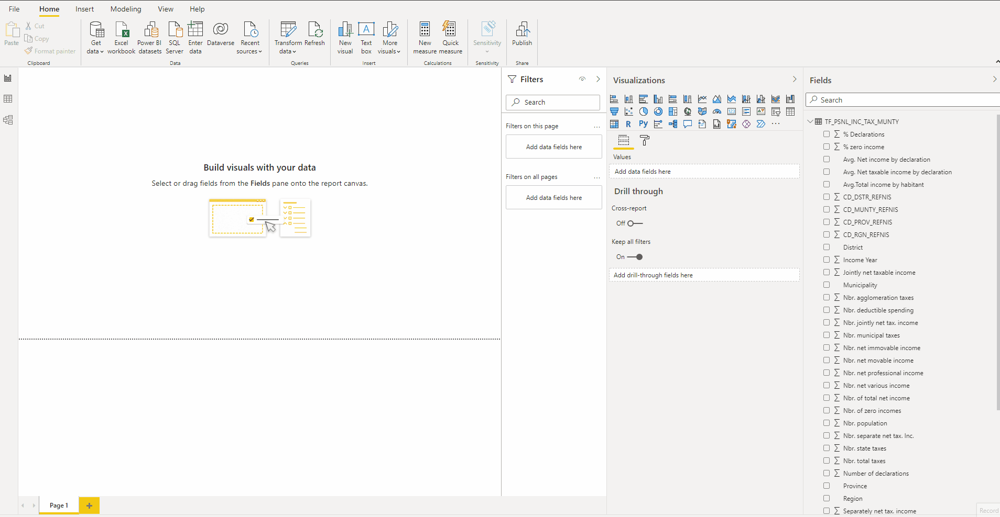
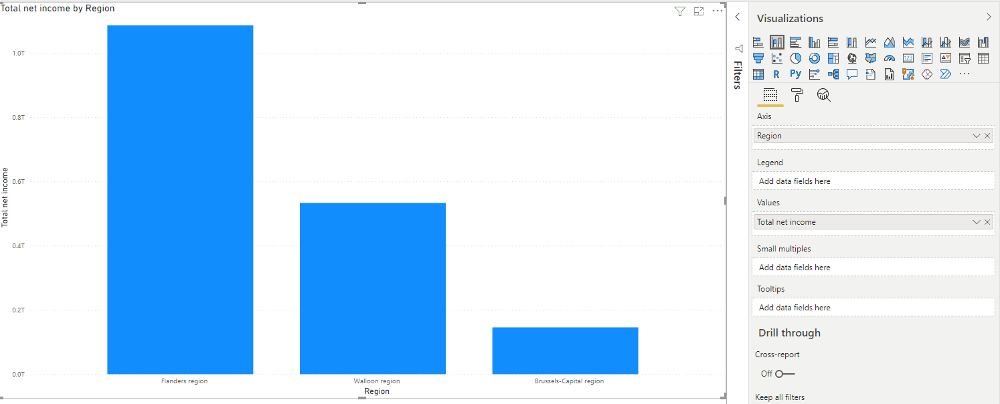
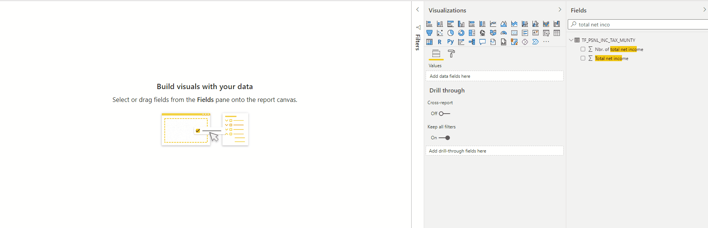
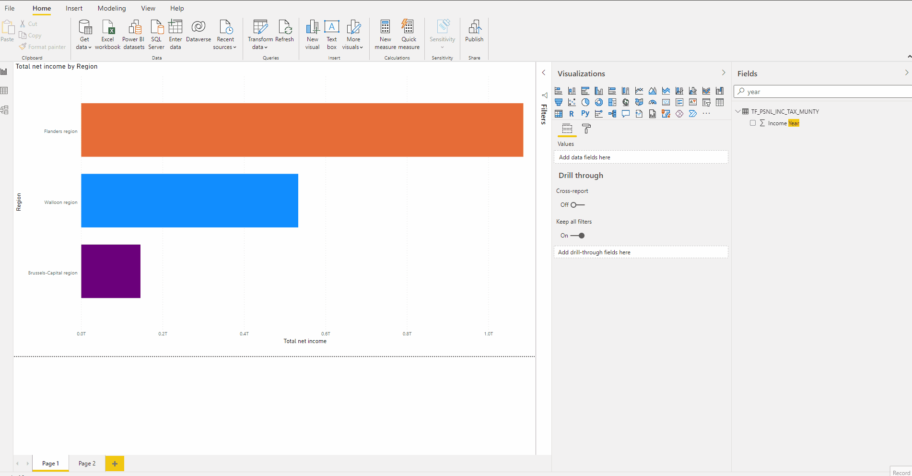

# Your first dashboard

We have done some pre-processing, now it's moment to transform thousands of data points in visuals that tells a story.

## Bar and column charts

- Let's start by visualizing bar charts representing `Total net income` by `Region`.

On the left panel `Field` you can search the columns and later drag and drop the columns of interest to the visual area. PowerBi will automatically inferred the type of graph that betters adjust to the data, you can freely change the type of visualization selecting the one of your interest on the panel `Visualizations`.

- Explore different type of charts to visualize the total net income by region, feel free to select the one of your preference as long as the information is easily transmitted to your audience.

- Edit the bar chart and assign a different color to each region

## Line charts

- Make a line chart to represent the `Total net income` as a function of `Income year`.

## Your canvas for creativity

The area for visualization could be limited when you need to do multiple plots, however, the size of your visuals can be adapted at convenience and if you need more space, you can extra pages to your project:

- Take a few minutes and explore the several possibilities for data visualization and think about the possible designs for your own dashboard.

## Geographical information

As you might notice, the dataset includes name of provinces, regions, municipalities, districts and ZIP codes in Belgium. This information can be visualize using  `Maps` or `Filled Maps`. In future exercises, we will practice the use of this function.

_Power BI includes built in functions that will automatically recognize the locations. When you are working with countries or regions, it's reccomended to use the three-letter abbreviation of the country's name to ensure that geocoding works properly. If you use other abbreviations some countries or regions might not be properly recognized._

### Geocoding does not work properly. How can I fix it ?

Resources that can be helpful: 

- [How-To: Display 2-letter country data on a Power BI map](https://blog.ailon.org/how-to-display-2-letter-country-data-on-a-power-bi-map-85fc738497d6#.yudauacxp)

- [Oficial docs Maps visualizations](https://docs.microsoft.com/en-us/learn/modules/visuals-in-power-bi/5-map-visualizations)

## Practice your new skills

Now it's time for you to continue exploring the tools and to build a first dashboard using the tools you have learned. 

**Build your dashboard completing the following tasks:**

- Clustered column chart representing `Total Taxes` by `Region`
- `Treemap` with `Number of declarations` by `Region`
- Stacked column chart representing `Total net income` by `Municipality`
- Donut Chart with `Population` by `Region`
- Filled map with information about `Municipality` and `Region`
- Feel free to try different colors to represent the information on your charts.

**Well done 😁 your first dashboard is completed, you are ready to get more skills on PowerBi.**

## Extra challenge

Would you like to compare your dashboard and information with the official report from _STATBEL, Belgium in Figures_ ?

You can visit the official websites and read the summary:

[STATBEL, Belgium in Figures](https://statbel.fgov.be/en/themes/households/taxable-income)

Can you think on a better way of presenting their results?

## Additional Resources
- [A detailed guide to colors in data vis style guides](https://blog.datawrapper.de/colors-for-data-vis-style-guides/)
- [The Dos and Don’ts of Dashboard Design](https://towardsdatascience.com/the-dos-and-donts-of-dashboard-design-2beefd5cc575)
- [Building a Color Palette for your Dashboards](https://medium.com/@Santhanalakshmip/building-a-color-palette-for-your-power-bi-dashboards-bda288c4029e)

# [Next step](./04.Interactive_dashboard.md)
