## Building an interactive dashboard

One advantage of using Power BI is that you can build a dashboard where the user can choose to see the exact information of interest instead of a full overview of the data.

For example, on the provided dataset, the information is organized by year but on the previous dashboard we built, the user does not have the option to select the information corresponding to a year of interest. How can we add this functionality ?

## Slicer in Power BI

1. Go back to your first dashboard and add a new page to your project.

2. On the visualization panel, click on the icon `Slicer` to create a new slicer on the canvas.

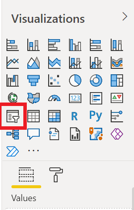

3. Drag and drop: Drag the feature `Income year` from `Fields` and drop it on the visual frame created after clicking on `Slicer`.

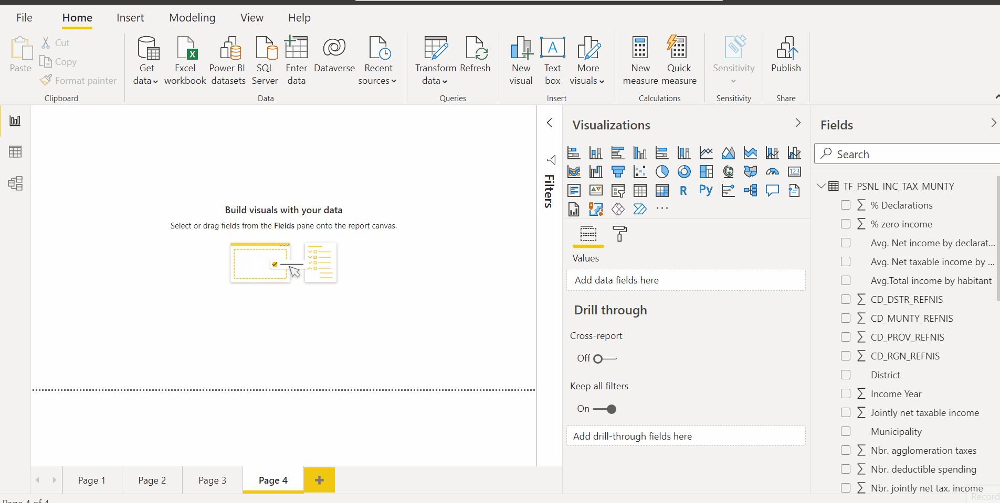

4. On the visualization panel, click on the icon `Card` and add the `Nbr. population` to visualize the total population of Belgium by year.

5. Move the slicer to see how the values change according with the selected range of years.

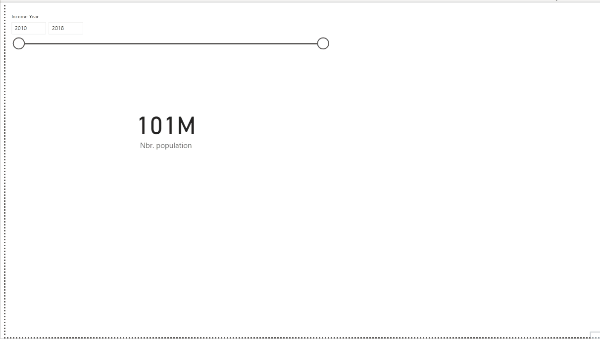

- Move the slicer to display the population corresponding just to the fiscal year 2018. You will see that on 2018, the population is 11 Million of inhabitants
- Move the slicer to see the population on the period 2010-2018. In this case, you will see the card showing a value of 101 Millions of inhabitants. Is this information properly displayed ?

The card is displaying the population not year after year but the sum of the population reported on the selected period. As a designer of the dashboard, it's important to evaluate the best way to transmit the information to the user and be mindful about these possible errors.

Let's explore a solution to properly visualize the population of Belgium by year.

## Dropdown menu and list

Instead of using a slicer, sometimes could be more helpful to use a dropdown menu or a list where the user can specifically select a value. 

For example, instead of selecting a range of income years provide the possibility of selecting the year of interest.

1. Go to upper-right corner of the slicer and click on the arrow, you will see a menu that will allow you to select among several options.

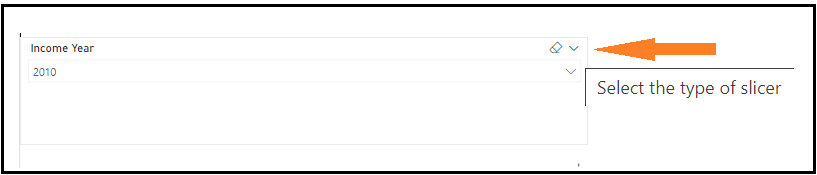

2. Select from the menu the options `Dropdown` or `List` to update the type of slicer for the dashboard.

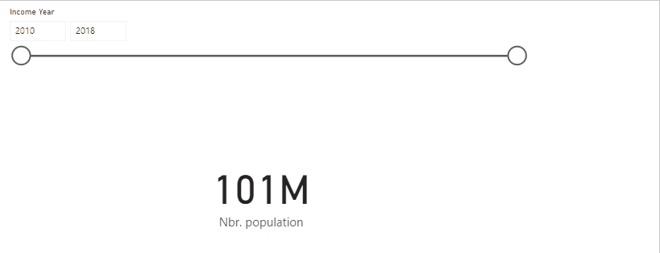

3. Explore the dropdown menu and evaluate the change of population throughout the years. Can you observe any change on the `Card` ?

If you don't see any changes, probably it's due to the `Card` with the population it's not configure to show decimal positions. This can be easily change using the visualizations menu as follows:

- Select the visual `Card`
- On the visualization panel, click on `Format`

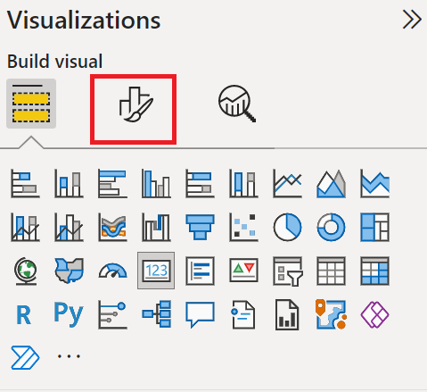

- Click on `Data Label` and update `Value decimal places` and `Display units` at convenience.

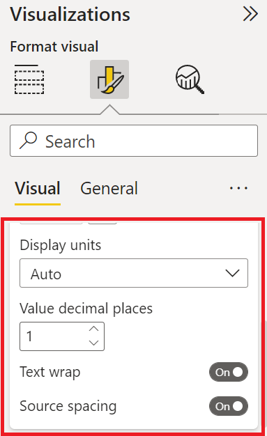

## 
By adjusting the decimal values we can see the differences among years more clearly!

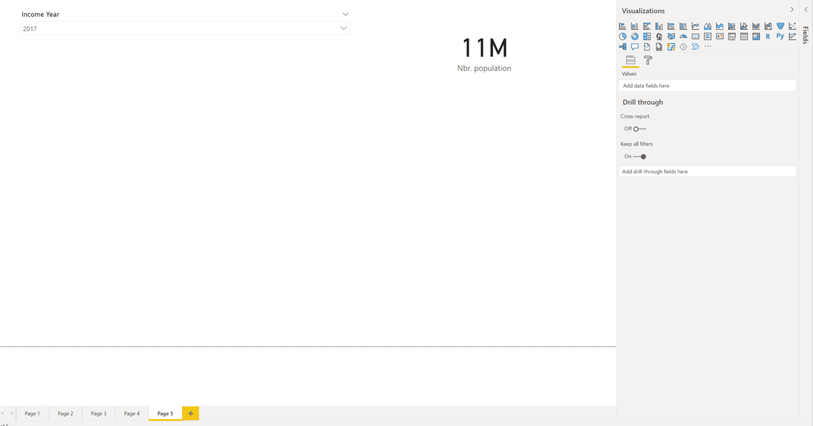

## Interactions slicer-visuals

1. Insert an `100 % Stacked column chart` to display the `Population` by `Income Year` for the the three available regions.

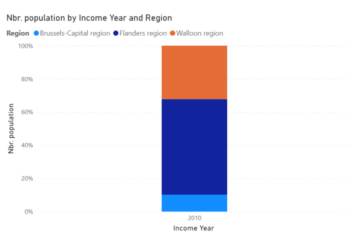

Your population chart is updated according by the year selected on the dropdown menu.

2. Insert a `Line chart`  to display the `Population` by `Income Year` for the the three available regions.

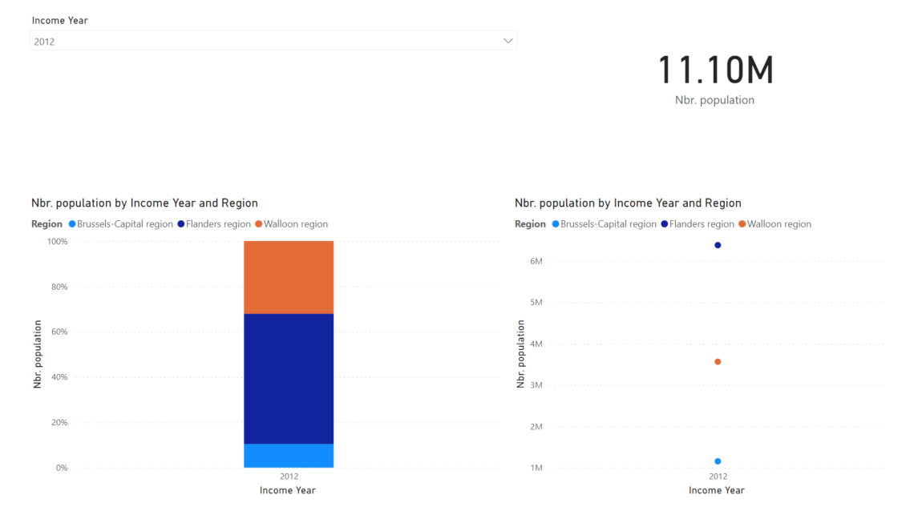

The line chart is representing three points rather than a line that could help us understand changes of population through the time, in this case, the use of the dropdown menu is not helpful to display the information. **To solve this issue we will edit the way the slicer interacts with the visuals.**

- Click on the drop-down menu
- On the panel tools, click on `Format`
- Click on `Edit Interactions`

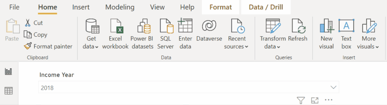

Now you can see a couple of new icons on top of your visuals:

This icons allows to select if the selection of the slicer affects or not the corresponding visual. In this case we can the `Line Chart` to be independent from the selections on the slicer.

- Move the mouse to the `Line chart` and click on no filter
- You will see how the chart immediately changes to show the distribution of the population for the period 2010-2018. 

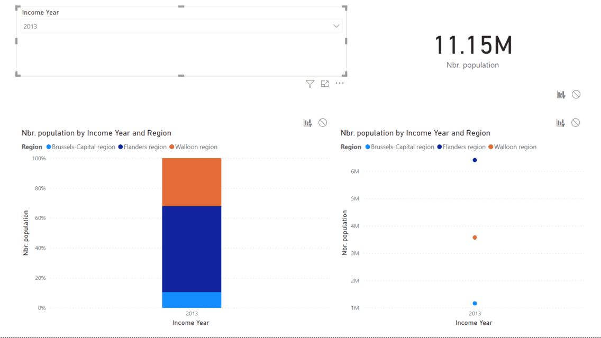

## Multiple slicers

The use of slicers and dropdown menus for an interactive dashboard is not limited to the use of a unique one on the contrary, multiple ones can be used at convenience.

1. Go to the visualization panel and insert a new slicer.
2. Drag and drop the feature `Region` into the new visualization panel
3. Edit the slicer to visualize the three regions on a `List` format

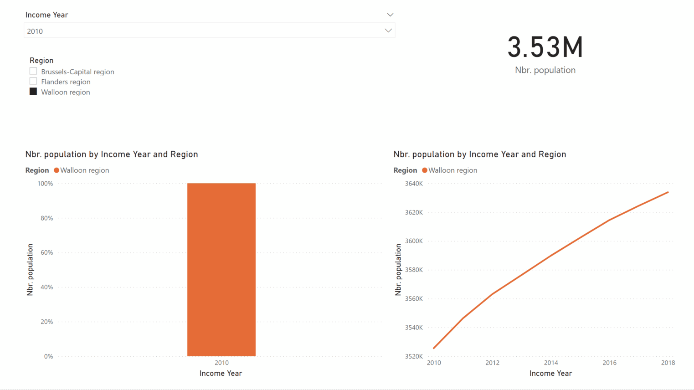

Now the dashboard shows more options to users, however it can be improved, for example by allowing the user to select not just a simple option but many at the same time. 

**To add this functionalities the slicer can be adjusted at convenience using the option `Format` included on the visualization panel.**

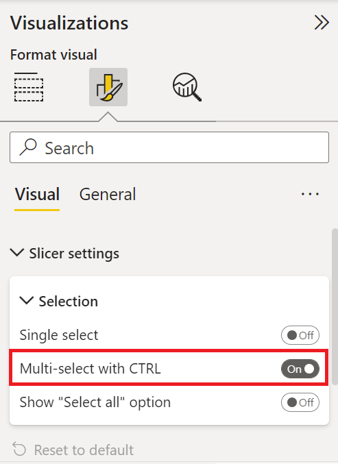

 

## Add your own twist

Can you find a way to incorporate the questions you came-up with in [Getting Started](./02.Getting_started.md) into your dashboard?

Ta-da! You've built your first interactive dashboard.

There are still many features to explore in PowerBI! Take a look at the resources below. 

## [Next: Additional resources](./05.Resources.md)
