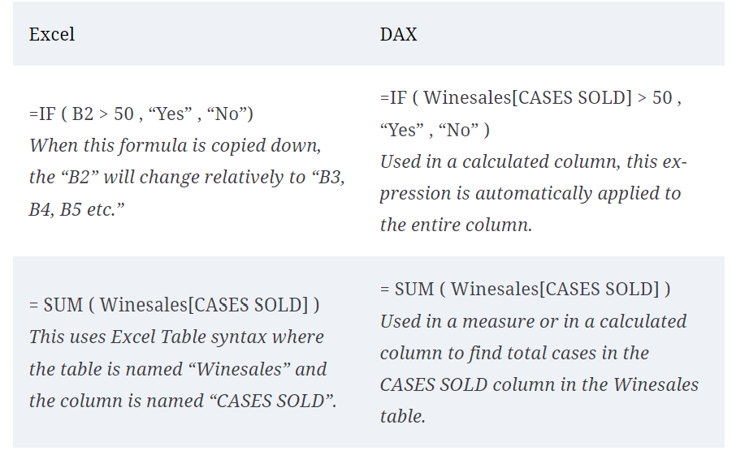
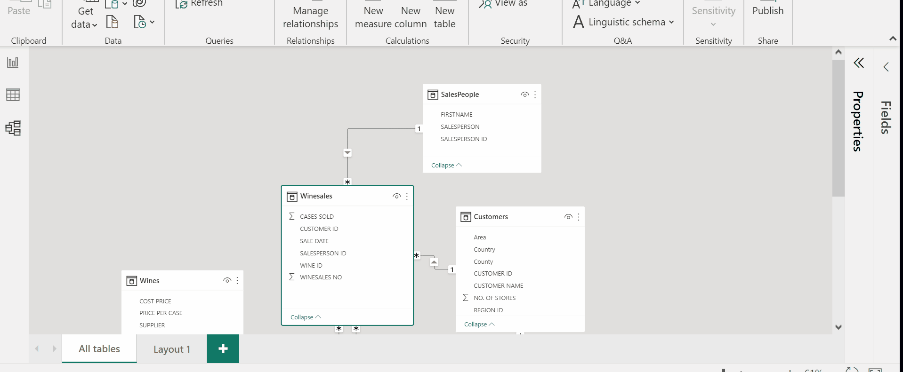

# Introduction to DAX

Taking stock of our progress so far, we’ve put our data in Power BI and reviewed many of the visuals and interactive features readily available in Power BI using a single data source. 

As a data analyst, you will encounter many scenarios where you need to create custom metrics over multiple data sources. 

**Data Analysis Expressions (DAX)** is the language of the formula engine of Analysis Services Tabular and Power BI. It is a multifunctional query language that can be used to obtain specific results or create calculated tables or columns. Anytime you create a visual in Power BI, it generates DAX behind the scenes to get the data from the Power BI storage engine.


The goal of this chapter is to introduce you to DAX and give you the confidence to start exploring this language on your own. DAX contains more than [250 functions to explore](https://learn.microsoft.com/en-us/dax/dax-function-reference)!

### DAX vs. Excel Syntax

One thing to note, is that if you are familiar with Excel functions, you can notice some similarities between the syntax. 

Two major differences are:

* You **can’t** reference “cells.” The only two objects that are referenced in DAX expressions are tables and columns.
* In Excel, you use the AND() and OR() functions. In DAX, you typically use these operators instead; AND is && (double ampersand) and OR is || (double pipe).

For example, see the image below.



DAX can become messy fast so keep in mind to format it in an readable way. Read more: 

* If you want to quickly format your untidy DAX code, use the DAX formatter [here](https://www.daxformatter.com/).

* You can also find more information and guidelines on best practices [here](https://www.sqlbi.com/articles/rules-for-dax-code-formatting/).


As you can see, your logical Python thinking is not lost either! Many expressions will need conditionals and thinking in terms of row/columns operations. 

You've already applied very simple DAX commands, let's look at an example with a more complex data structure. 

## Wine Sales Example
We will use the sample dashboard from `Up and Running with DAX for Power BI by Alison Box (Apress, 2022)` you can find it [here](data/1%20DAX%20Sample%20Data.pbix) which includes the following tables:

* Winesales – Records our sales transactions.

* Wines – Records the names and details of the wines we sell.

* Customers – Who we sell our wines to.

* SalesPeople – The people making the sales.

* Regions – Our customers are grouped into these regions.

* DateTable – Records every date, starting from the first day of the month when sales start and ending with the last date in the current financial year, categorizing these dates into year, quarter, and month.

This sample dashboard contains a data model that relies on connecting these tables. You can see a diagram of the model below.


This structure is known as the star data model, one of the key aspects of DAX, is that the details of your DAX expressions are tied to the data model. The simpler the model, the more straightforward the calculations. Read more: [Model relationships in Power BI Desktop](https://learn.microsoft.com/en-us/power-bi/transform-model/desktop-relationships-understand). 

# DAX expressions

In DAX, there are three types of expression: calculated columns, measures, and calculated tables. Let's take a look at how to apply each of them to our example.

## Calculated columns

Unlike custom columns that are created as part of a query by using `Add Custom Column` in Power Query Editor, calculated columns that are created in Report view, Data view, or Model view are based on data you've already loaded into the model. 

For example, you might choose to concatenate values from two different columns in two different but related tables, do addition, or extract substrings.

Say your manager interested in the knowing which employees are selling high vs. low volumes of wine cases and to which customers.

Before jumping to DAX, ask yourself:

* Which tables or columns contain relevant information?
* What threshold will I use to determine high or low volume of sales?
* How many columns do I need to get the information I need?

Let say, I talk to an experienced manager and they mentioned that if you sell more than 50 cases that is considered high volume, otherwise you are considered as a low volume seller. 

1. Create a new column that assigns `High` and `Low` to each sales person according to the rule above. 

    `VOLUME SOLD =
IF (
    Winesales[CASES SOLD] >= 50
        && Winesales[CASES SOLD] <= 400,
    "High",
    "Low"
)
` 



2. It would be useful to have also the information of the customer in the same table. For that we'll use a powerful function `RELATED` which is similar to `VLOOKUP` in Excel. 

Let's create a new column, to make it clear, we'll name it `Customer Name from Customers Table`.

 `Customer Name from Customers Table = RELATED ( Customers[CUSTOMER NAME] )`

 Often, the generation of the calculated column using `RELATED` where you populate values from related tables is used solely for ad hoc reasons. Once you have the customer names alongside their transactions, you’ll find it’s often easier to cross-check your data analysis. Once the column has served its purpose, it can be removed.

You can only use this function in the following two circumstances:
* The tables must be related.
* Only values from tables on the one side of a relationship can be returned to tables on the many side.

#### **Exercise**: Add a column that calculates the sales.

## DAX measures

Measures are used in some of the most common data analyses. Simple summarizations such as sums, averages, minimum, maximum and counts can be set through the `Fields` well.  We have seen measures already implemented in PowerBI, now let's create our own!

### Implicit and Explicit Measures

An **implicit measure** is not strictly defined before being brought into a visual. This happens when you drag a column in, and it sums, or you tell it to average or perform some other aggregation.

An **explicit measure**, on the other hand, is a specific DAX measure that you create in your data model with a predefined calculation that you then add to a visual. These let's use perform more complicated calculations. 

We'll focus on the latter!

Say, we want to know how many sales we have per wine type. You might be tempted to use the implicit measure `COUNT` however, this works only on columns. 

We can use the explicit DAX function `COUNTROWS` which accepts a table as its only argument which is the table whose rows you want to count, so this would be the expression:

`No. of Sales = COUNTROWS ( Winesales )`

One of the benefits of creating these simple measures is that you can use them to analyze any items from any dimension. 

As you generate visuals, taking items from different dimensions, the measures will consistently recalculate accordingly.


Some final thoughts, 

1.	 All visuals on the report canvas use measures.

 
2.	Measures return scalar (single) values.

 
3.	Measures are calculated where a filter has been placed on the data model.

## When to use columns vs measures?

There are many differences between calculated columns and measures in Power BI. Below is a cheat sheet to know when to break out either tool. You can read more [here](https://coffeebreakdata.com/pbi-calc-vs-measure/).


## DAX coding using variables

You can think about a variable as a name for an expression. The term “variable” itself is somewhat misleading – a DAX variable cannot change its value, as the name would suggest. A DAX variable is indeed a constant, meaning that it is a name for the value computed by the definition of the variable.

You can define a variable in any DAX expression by using `VAR` followed by `RETURN`. In one or several `VAR` sections, you individually declare the variables needed to compute the expression; in the `RETURN` part you provide the expression itself.

```
    Example Measure =
    VAR MyVariable = SUM (Winesales[CASES SOLD])
    RETURN
        MyVariable * 1.1
```

As an example of how variables can improve performance, let’s look at a measure to calculate 10% or 5% of the CASES SOLD based on the CASES SOLD value being greater than 20,000 and 15,000, respectively. This would be the expression you might author:

```10 PC or 5 PC =
IF (
    SUM ( Winesales[CASES SOLD] ) > 20000,
    SUM ( Winesales[CASES SOLD] ) * 0.1,
    IF (
        SUM ( Winesales[CASES SOLD] ) > 15000,
        SUM ( Winesales[CASES SOLD] ) * 0.5,
        SUM ( Winesales[CASES SOLD] )
    )
)
```

We can use the [function](https://learn.microsoft.com/en-us/dax/switch-function-dax) `SWITCH`, the [function](https://learn.microsoft.com/en-us/dax/true-function-dax) `TRUE()` is used as the expression to be evaluated (returns always True).

Then Boolean statements are listed, followed by the value to be returned if the statements are true. 

The final argument is the `else` expression.

```
10 PC or 5 PC #3 =
VAR TotalCasesValue =
    SUM ( Winesales[CASES SOLD] )
RETURN
    SWITCH (
        TRUE (),
        TotalCasesValue > 20000, TotalCasesValue * 0.1,
        TotalCasesValue > 15000, TotalCasesValue * 0.5,
        TotalCasesValue
    )
```    

Variables can also help to clarify expressions that use nested measures or nested expressions where the readability of the expressions gets more convoluted. 

For example, consider the following expression that calculates growth percentage.

```
Growth % =
VAR CurrentCases = [Total Cases]
VAR LastYrCases =
    CALCULATE ( [Total Cases], PREVIOUSYEAR (
                            DateTable[DateKey] ) )
RETURN
    DIVIDE ( CurrentCases - LastYrCases, LastYrCases )
```

With these few examples we have seen the power of DAX expressions in PowerBI!

## Additional Resources

* [QuickStart: Learn DAX Basics in 30 Minutes](https://support.microsoft.com/en-us/office/quickstart-learn-dax-basics-in-30-minutes-51744643-c2a5-436a-bdf6-c895762bec1a)
* [Use DAX in Power BI Desktop - Learning Path](https://learn.microsoft.com/en-us/training/paths/dax-power-bi/)
* [Introduction to DAX - DataCamp Course](https://www.datacamp.com/courses/introduction-to-dax-in-power-bi)
* [Use variables to improve your DAX formulas](https://learn.microsoft.com/en-us/dax/best-practices/dax-variables)