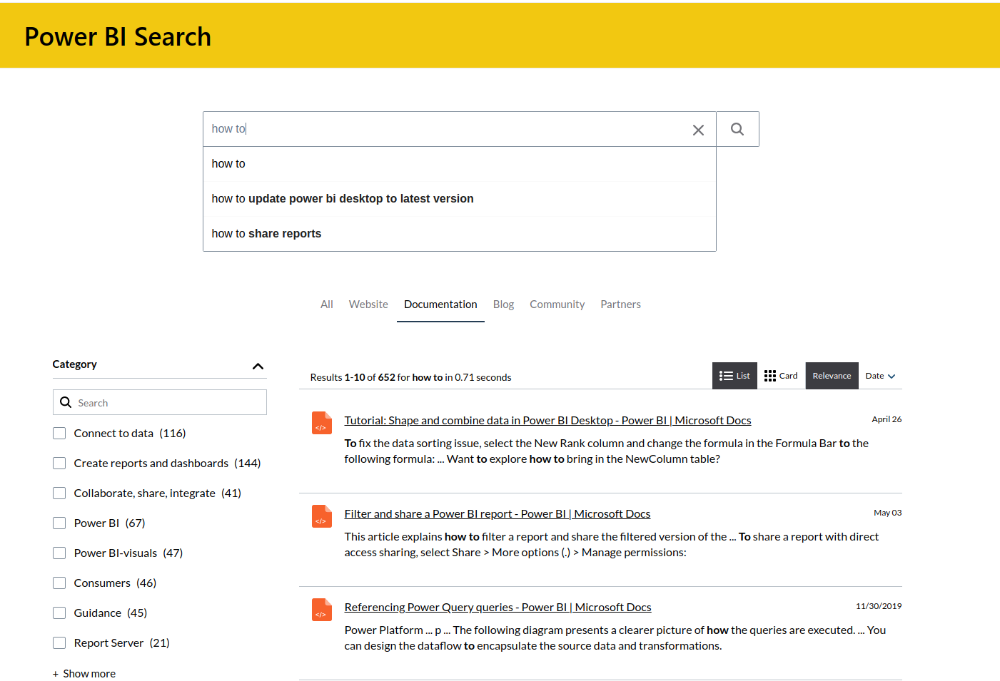

# Learning resources

Learning by doing is highly encourage, getting hands on your project, explore datasets and build dashboards to feed your intellectual curiosity is a great way to continue building your skills.

_I am always doing that which I cannot do, in order that I may learn how to do it._ - Pablo Picasso

There's a series of resources that you can follow in the case you need some extra help or even if you are interesting in obtaining a Power BI certification.

## Microsoft documentation

_This learning path can help you prepare for the PL-300: Microsoft Power BI Data Analyst._

* [Official documentation](https://learn.microsoft.com/en-gb/certifications/exams/pl-300)

Also, PowerBI is updated on a monthly basis! To keep track of the latest updates to the software please refer to the [`What's new in Power BI?`](https://learn.microsoft.com/en-us/power-bi/fundamentals/desktop-latest-update?tabs=powerbi-desktop) page. 

## DataCamp
_Through Data Camp you can complete skill and career track to further enhance your skills._

* [PowerBI Fundamentals](https://app.datacamp.com/learn/skill-tracks/power-bi-fundamentals)
* [Data Analyst in PowerBI](https://app.datacamp.com/learn/career-tracks/data-analyst-in-power-bi)

**Note:** You'll also receive a 50% discount code for the [Microsoft PL-300 certification](https://learn.microsoft.com/en-us/certifications/exams/pl-300) after completing half of this track to help you supercharge your data analyst career!

## Inspiration

If you are looking for ideas or inspiration from the work of people building dashboards, you can visit the gallery of data stories:

* [Data stories gallery](https://community.powerbi.com/t5/Data-Stories-Gallery/bd-p/DataStoriesGallery?wt.mc_id=pbirm_eml_community-Nurture)

## Ask for help

Connect with the community that works with Power BI and ask for help in the forum:

* [Power BI support forums](https://powerbi.microsoft.com/en-us/support/)

