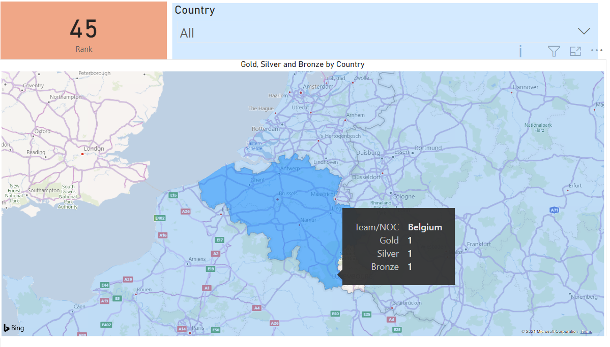
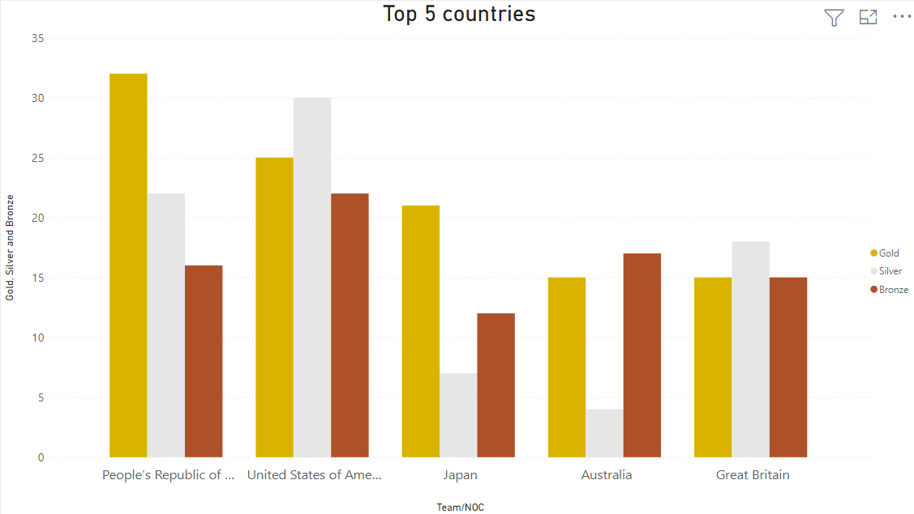
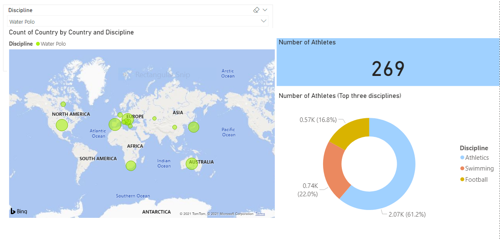

# Tokyo Olympics dashboard

You are a Data Analyst working for a world-wide known sports brand and they are interesting on a dashboard summarizing the results of the Olympics by country, medals and discipline. The results will be used by the brand to define their marketing campaigns for the next year.

Your mission is to build a dashboard where the marketing department can easily access to the information and generate a report for their decision making. The department give you the freedom to choose the design and to explore the dataset, however there are some fundamental insights they would like to see.

## The medals dashboard

Build a dashboard to show on a map, the countries participating on the Olympics and the medals obtained after the participation.

**For this task, you will work with the file `Medals.xlsx` included on the folder `data`.**

- Include a Slicer to select the country of interest and the total of Gold, Silver and Bronze obtained.
- Include a card to display the country's rank.

A minimal version of your dashboard, should look like:

- What are the top 10 countries who won more Gold medals ?
- What country won more medals in general ?

- Add a second page on the dashboard to present the performance of the top 10 countries with the best performance on the Olympics.

You can be as creative as you want to represent the data, if you need an idea to start building the dashboard, you can follow this example:

## Athletes and disciplines

**For this task, upload to your Power BI project the data from `Athletes.xlsx` and `Teams.xlsx` included on the folder `data`.**

The brand already knows the performance of several countries based on the medals they won but they required from you a deeper analysis of the information. They want to explore the disciplines of the Athletes participating.

- Add a new page to your project a build a dashboard to report insights about the disciplines and athletes.

Think about you as a reporter asking questions to the data, for example:

- What disciplines are mostly represented by country?
- What disciplines counts with the participation of more athletes ?
- Does Belgium have a beach volleyball team? What discipline could be advertised on the country?
- How many event's are played on Mixed Teams ? Which ones ?

An example of how your dashboard could look like is showed below, notice that in the map, the bubbles are representing the country and the size how many athletes are competing on the discipline, this helps to provide richer visuals.

### Congratulations! You have completed a series of challenges on the journey to learn Power BI. 

### You are awarded the Gold medal!

