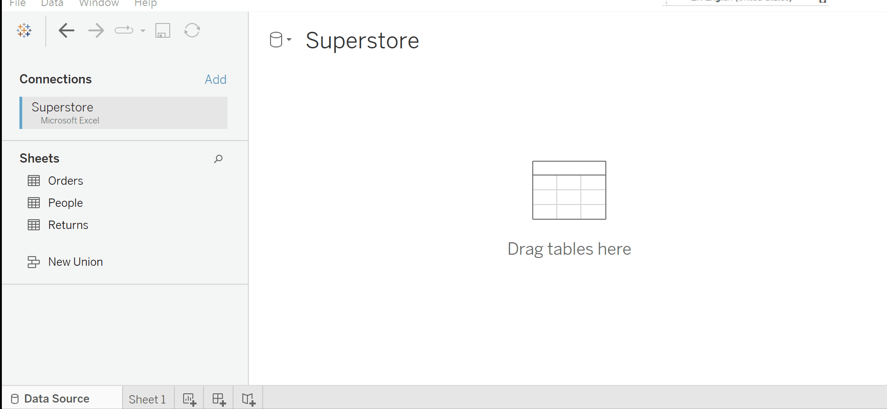
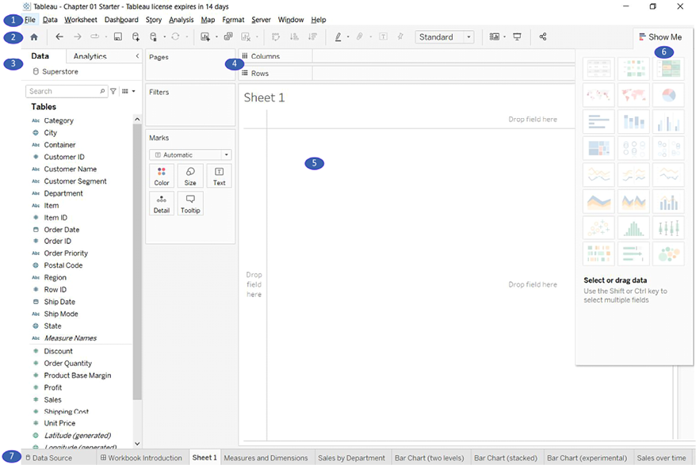
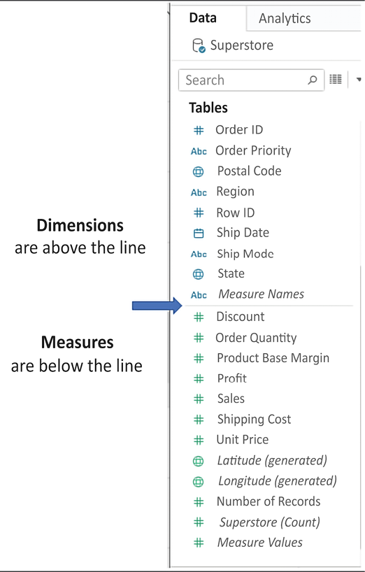
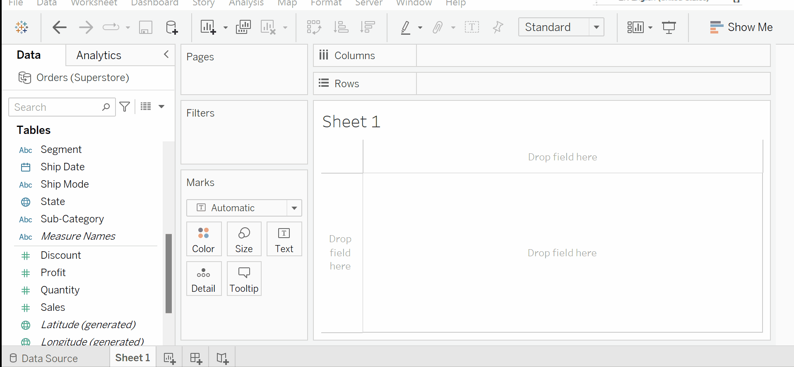

# Getting started with Tableau

Tableau is an amazing platform for seeing, understanding, and making key decisions based on your data! With it, you will be able to carry out incredible data discovery, analysis, and storytelling.

In this section, we will explore  the foundational principles of Tableau. We’ll go through a series of examples that will introduce you to the basics of connecting to data, exploring and analyzing data visually, and finally putting it all together in a fully interactive dashboard.

## Connecting to Data

Tableau connects to data stored in a wide variety of files and databases.  

We’ll connect to a text file derived from one of the sample datasets that ships with Tableau: [Superstore.xls](./data/Superstore.xls). 

Superstore is readily available dataset provided by Tableau.

Let's get started!

* Open Tableau. You should see the home screen with a list of connection options on the left and, if applicable, thumbnail previews of recently edited workbooks in the center, along with sample workbooks at the bottom.
* Under `Connect` and To a `File`, click on `Microsoft Excel`.
* In the `Open dialog box`, navigate to the appropiate directory and select the `Superstore.csv` file.

## Building your first visualization

When you first connect to a data source such as the `Superstore file`, Tableau will display the data connection and the fields in the `Data pane`. 

Notice that we have 3 tables available to explore: `Orders, People, Returns`.

We can drag a specific table to explore the columns and data it contains. 

For this connection, no other configuration is required, we will focus on analysing the `Orders` table. 

Simply click on the Sheet 1 tab at the bottom of the Tableau window to start visualizing the data! You should now see the main work area within Tableau, which should look similar to this:

### Understanding Tableau's Interface

On a first look it can be a lot of information to take in! So let's dive in to some of the main components of Tableau's interface.

1. The `menu` contains various menu items for performing a wide range of functions.
2. The `toolbar` allows common functions such as undo, redo, save, add a data source, and so on.
3. The `Data pane` is active when the Data tab is selected and lists all tables and fields of the selected data source. The Analytics pane is active when the Analytics tab is selected and gives options for supplementing visualizations with visual analytics.
4. Various shelves such as `Pages, Columns, Rows, and Filters` serve as areas to drag and drop fields from the data pane. The `Marks card` contains additional shelves such as `Color, Size, Text, Detail, and Tooltip`. Tableau will visualize data based on the fields you drop onto the shelves.
5. The `canvas or view` is where Tableau will draw the data visualization. In addition to dropping fields on shelves, you may also drop fields directly onto the view. A title is located at the top of the canvas. By default, the title displays the name of the sheet, but it can be edited or hidden.
6. `Show Me` is a feature that allows you to quickly iterate through various types of visualizations based on data fields of interest. 
7. The tabs at the bottom of the window give you options for editing the data source, as well as navigating between and adding any number of sheets, dashboards, or stories. Often, any tab (whether it is a sheet, a dashboard, or a story) is referred to generically as a `sheet`.

Fields can be dragged from the data pane onto the canvas area or onto various shelves such as `Rows, Columns, Color, or Size`.  As we’ll see, the placement of the fields will result in different encodings of the data based on the type of field.

### Measures and dimensions

The fields from the data source are visible in the `Data pane` and are divided into `Measures and Dimensions`.

The difference between Measures and Dimensions is a fundamental concept to understand when using Tableau:

* **Measures** are fields that can be aggregated in some way, such as a sum or an average. Think of it as something that can be collected, counted, or combined in some way to return a single value.
* **Dimensions** are fields that can be used to split up another field or measure into distinct groups. It can be used to define the level of detail to perform an aggregation on. 

You may find this [infographic](https://www.educba.com/tableau-dimension-vs-measure/) useful to understand the main differences between the two.

## Let's try it out! 

Say, we want to know what are the sales of our superstore per region?

* Measure: Ideally, we would have the total sum of `Sales`. 
* Dimension: And we would want to split that according to `Region`. 

We can drag the `Sales` measure to the `Rows` field. We see that it display's the lump sum of sales as the default. 

Next, we can drag the `Region` dimension to add more detail to the chart. 

You have created your first visual!

The `Sales` field is used as a measure in this view. Specifically, it is being aggregated as a sum. When you use a field as a measure in the view, the type aggregation (for example, `SUM, MIN, MAX, and AVG`) will be shown on the active field.

### Discrete and continuous fields

Another important distinction to make with fields is whether a field is being used as` discrete or continuous`. Whether a field is discrete or continuous determines how Tableau visualizes it based on where it is used in the view. Tableau will give a visual indication of the default value for a field (the color of the icon in the Data pane) and how it is being used in the view (the color of the active field on a shelf). 

* Discrete fields, such as `Region` in the previous example, are blue. 
* Continuous fields, such as `Sales`, are green.

### Summary

In general, you can think of the differences between the types of fields as follows:

* Choosing between a dimension and measure tells Tableau how to slice or aggregate the data.
* Choosing between discrete and continuous tells Tableau how to display the data with a header or an axis and defines individual colors or a gradient.

As you work through the examples, pay attention to the fields you are using to create the visualizations, whether they are dimensions or measures, and whether they are discrete or continuous. 

Experiment with changing fields in the view from continuous to discrete, and vice versa, to gain an understanding of the differences in the visualization. 

## Additional Resouces

* [Tableau: Measures vs. Dimensions](https://medium.com/swlh/tableau-measures-vs-dimensions-cb9986fecef9)