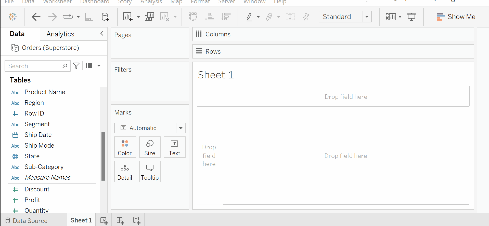
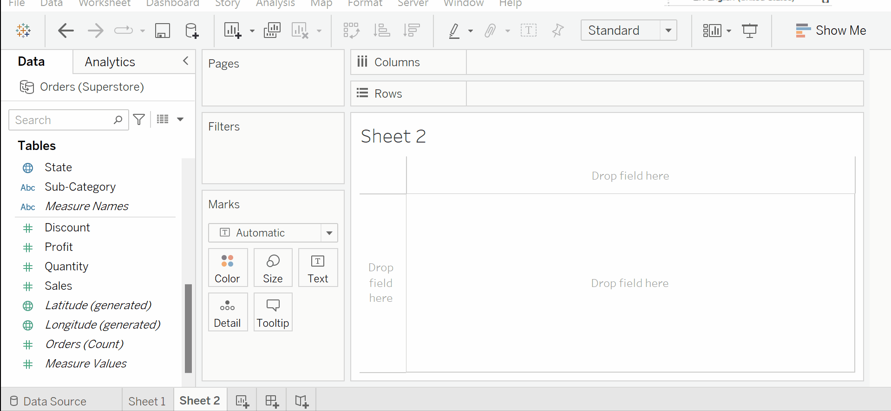
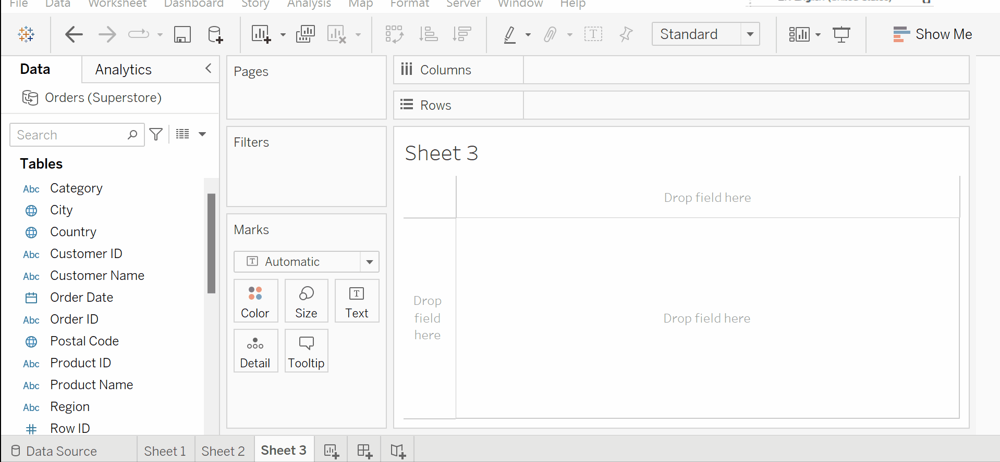
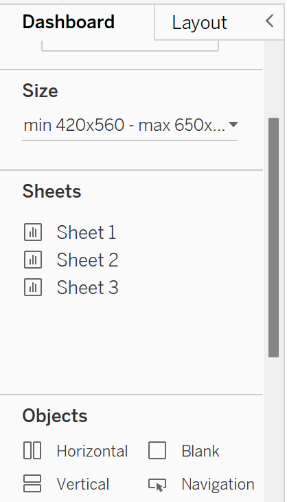
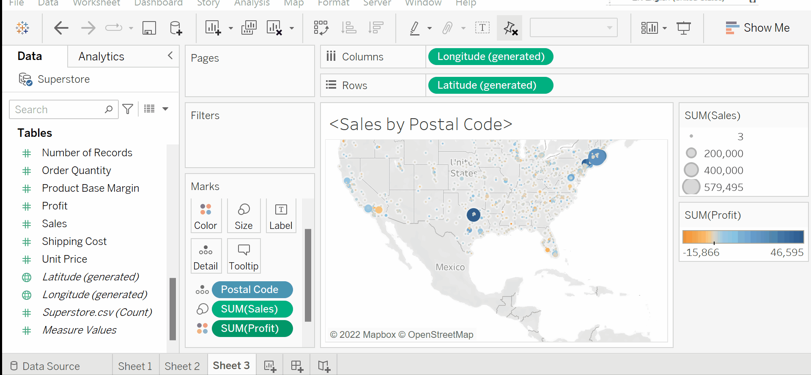
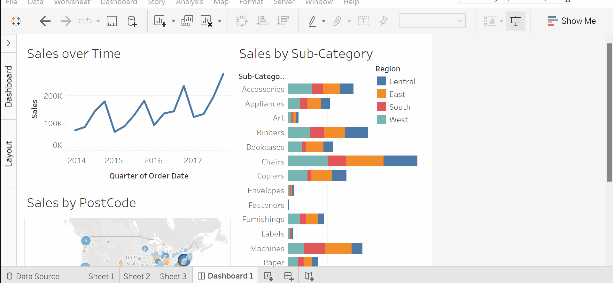
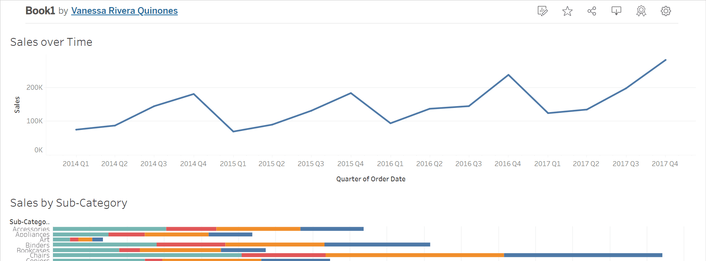

# Your first dashboard with Tableau

A Tableau workbook is a collection of data sources, sheets, dashboards, and stories. All of this is saved as a single Tableau workbook file (.twb or .twbx). A workbook is organized into a collection of tabs of various types:

* A `sheet` is a single data visualization, such as a bar chart or a line graph.Just like our previous example!
* A `dashboard` is a presentation of any number of related views and other elements (such as text or images) arranged together as a cohesive whole to communicate a message to an audience. 
* A `story` is a collection of dashboards or single views that have been arranged to communicate a narrative from the data. Stories may also be interactive.

In this section, we will focus on building your first dashboard with Tableau.

## When to use a dashboard?

Dashboards are often interactive and allow end users to explore different facets of the data.

Dashboards serve a wide variety of purposes and can be tailored to suit a wide variety of audiences. Consider the following possible dashboards:

* A summary-level view of profit and sales to allow executives to take a quick glimpse at the current status of the company
An interactive dashboard, allowing sales managers to drill into sales territories to identify threats or opportunities
* A dashboard allowing doctors to track patient readmissions, diagnoses, and procedures to make better decisions about patient care
* A dashboard allowing executives of a real-estate company to identify trends and make decisions for various apartment complexes

I hope the pattern is clear now! 

A great dashboard transforms our visuals into business insights. It communicates what is the relevant information to make better decisions. 

**Note:**  Not every collection of visuals is a dashboard! These visuals should convey a message in the most effective way possible. 

## What to visualize in a dashboard?

Before jumping into your first dashboard, it will be a good idea to think of what type of visuals would be helpful to include. 

As you work through the examples, keep in mind that the goal is not simply to learn how to create a specific chart. Rather, the examples are designed to help you think through the process of asking questions of the data and getting answers through iterations of visualization. 

Create a visualization for each of the following questions in separate sheets.

1. How much revenue of `Sales` is earned by each `Sub-Category` and `Region`?. Rename this sheet as `Sales by Sub-Category`.

2. How have the `Sales` changed over time? Rename this sheet as `Sales over Time`.

3. Are there any geographic patterns in the `Sales`? Rename this sheet as `Sales by Postal Code`.

Tableau can generate the latitude and longitude automatically for certain [data types](https://help.tableau.com/current/pro/desktop/en-us/maps_data.htm) (e.g. cities, zip codes, states).

When we double-click on our `Post codes` dimension, we see a scatter plot of the postal codes overlayed on a map. However, it overlays the data over a map of Belgium.

Don't fret! We can correct this by using the `Edit location` feature and specifing the correct country for our postal codes. 

We can then add more details by changing the size of the points to reflect the amount of `Sales`, and use colors to further include information about the `Profit`.

## Building your dashboard

### The dashboard interface

You can create a new dashboard by clicking the `New Dashboard` button next to the tabs at the bottom of the Tableau window or by selecting `Dashboard | New Dashboard` from the menu.

One thing you’ll notice is that the left sidebar has been replaced with dashboard-specific content:

The left sidebar contains two tabs:

* A `Dashboard tab`, for sizing options and adding sheets and objects to the dashboard
* A `Layout tab`, for adjusting the layout of various objects on the dashboard

The Dashboard pane contains options for previewing based on the target device along with several sections:

* A `Size` section, for dashboard sizing options
* A `Sheets` section, containing all sheets (views) available to place on the dashboard
* An `Objects` section with additional objects that can be added to the dashboard.

You can add sheets and objects to a dashboard by dragging and dropping. As you drag the view, a light-gray shading will indicate the location of the sheet in the dashboard once it is dropped. You can also double-click on any sheet and it will be added automatically.

You are now ready to build a dashboard by following these steps:

1. Navigate to your blank dashboard, you can rename the tab to `Superstore Sales`.
2. Successively double-click on each of the following sheets listed in the Dashboard section on the left: `Sales by Department, Sales over time, and Sales by Postal Code`. Notice that double-clicking on the object adds it to the layout of the dashboard.

3. Add a title to the dashboard by checking Show Dashboard title at the lower left of the sidebar.
4.  Select the `Sales by Department` sheet in the dashboard and click on the drop-down arrow to show the menu.
5. Select `Fit | Entire View`. The `Fit` options describe how the visualization should fill any available space.
*Be careful when using various fit options. If you are using a dashboard with a size that has not been fixed, or if your view dynamically changes the number of items displayed based on interactivity, then what might have once looked good might not fit the view nearly as well.*

6. Select the `Sales` size legend by clicking on it. Use the X option to remove the legend from the dashboard.

7. Select the `Profit` color legend by clicking on it. Use the Grip to drag it and drop it under the map.
For each view `(Sales by Department, Sales by Postal Code, and Sales over time)`, select the view by clicking on an empty area in the view. Then, click on the `Use as Filter` option to make that view an interactive filter for the dashboard.

An example of your dashboard can look like this!

Take a moment to interact with your dashboard. Click on various marks, such as the bars, states, and points of the line. 

Notice that each selection filters the rest of the dashboard. Clicking on a selected mark will deselect it and clear the filter. Also, notice that selecting marks in multiple views causes filters to work together.

## Congratulations! 

You have now created a dashboard that allows you to carry out interactive analysis!

### Sharing your Dashboard
There are multple ways to share your dashboards with colleagues/clients.
Go to your Tableau Public profile, click on your dashaboard and you will see different icons on the top right corner.

* `Download` you dashboard from Tableau Public as a Tableau workbook. A small caveat: different versions of Tableau might have different features. Make sure to pick the correct version.

* You can also embedd it in your favorite website/self-built application/ or even with Streamlit! Just click `Share` and copy/pase the embedd code.

## Collaborating with Tableau

Let's say you are part of a team building a single dashboard, it can be difficult to combine every persons work (without our trusty Git). Below we list some recommendations:

* **Use pair programming for short deadlines.** Give a day or two for people create their own visuals and combine all the most relevant in a single dashboard that will become the team's MVP.
    - **Pros:** It ensures that all the preprocessing, data manupulation, and calculations are the same for everyone including naming of variables, columns, and calculations.
    - **Cons:** It does not scale well for complicated projects.

* **Use the combining features of Tableau workbooks**: You can read the following documentation, [Copying Information Between Workbooks](https://help.tableau.com/current/pro/desktop/en-us/copy_b_wkbks.htm). 

## Additional Resources
* [Creating a Map Based on Zip/Postal Codes
](https://kb.tableau.com/articles/howto/map-from-zip-codes)

