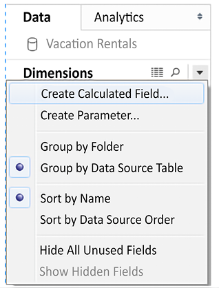
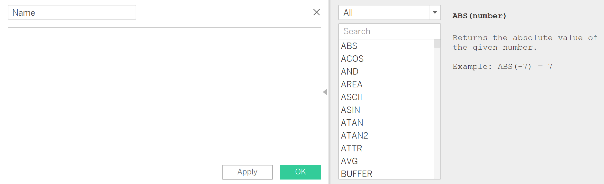
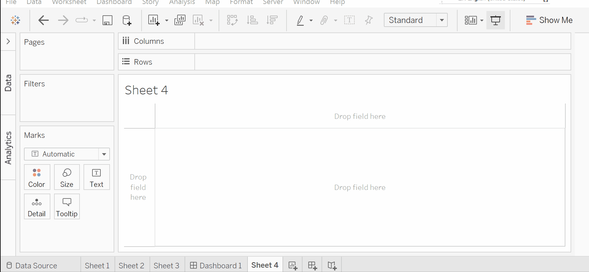

# Expanding Your Analysis with Calculations

Calculations significantly extend the possibilities for analysis, design, and interactivity in Tableau. Here see how calculations can be used in a wide variety of ways. We’ll see how calculations can be used to address common issues with data, extend data by adding new dimensions and measures, and provide additional flexibility in interactivity.

A calculation is often referred to as a `Calculated Field` in Tableau because, in most cases, when you create a calculation, it will show up as either a new measure or dimension in the data pane. Calculations consist of code that’s made up of functions, operations, and references to other fields, parameters, constants, groups, or sets. This code returns a value. Sometimes, this result is `per row` of data, and sometimes it is done at an `aggregate level`.

## Main Types of Calculations

The most fundamental way to understand calculations in Tableau is to think of four major types of calculations:

* **Row-level calculations:** These calculations are performed for every row of underlying data.
* **Aggregate calculations:** These calculations are performed at an aggregate level, which is usually defined by the dimensions used in the view.
* **Level of detail calculations:** These special calculations are aggregations that are performed at a specified level of detail, with the results available at the row level.
* **Table calculations:** These calculations are performed on the table of aggregate data that has been returned by the data source to Tableau.

## Creating and editing calculations
There are multiple ways to create a calculated field in Tableau:

* Select `Analysis | Create Calculated Field...` from the menu.
* Use the drop-down menu next to Dimensions in the Data pane and select `Create Calculated Field...`:



* Right-click an empty area in the` Data pane` and select `Create Calculated Field....`
* Use the drop-down menu on a field, set, or parameter in the data pane and select `Create | Calculated Field....` The calculation will begin as a reference to the field you selected.
* Double-click an empty area on the `Rows, Columns, or Measure Values` shelves, or in the empty area on the Marks card, to create an ad hoc calculation (though this will not show the full calculation editor).
* When you create a calculated field, it will become part of the data source that is currently selected at the time of creation. You can edit an existing calculated field in the data pane by using the drop-down menu and selecting `Edit....`
The interface for creating and editing calculations looks like this:




## Going back to our Superstore

Let's go back to our `Superstore` example. Some questions important to out analysis might require some calculations.

Say, you are a new data analysis hired for our Superstore. Your manager is looking to cut costs and he asked you to report on how costs have changed over time. While you have the `Sales, Discount, Quantity, and Profit` columns, there is no information about cost ... yet. Take a few moments to think about how you would approach this!

## One way to go

A good, first attempt might be reason, that the profit of a order is given by the sale amount before a discount minus the cost of the order.

Let's create a few calculated fields to help our analysis.

1. Create a calculated field called `Sales before discount` using  the following formula `Sales*(1+Discount)`.

2. Create a calculated field called `Cost` using use the formula below:

```Profit =  Sales*(1+Discount) - Costs```

from which we can deduct, 

```Cost =  Sales*(1+Discount) - Profit```



3. Create your custom calculated field!

4. How would you incorporate these new in your previous dashboard?

Voila! You've unlocked the power to create your own fields.

## Extra Practice

Tableau has a wide-variety of [functions](https://help.tableau.com/current/pro/desktop/en-us/functions_all_categories.htm) you can leverage!
 The following examples from the Tableau documentation will give you an idea of other calculations to add to your dashboard. Try them out! 
  
* [Understanding Calculations in Tableau
](https://help.tableau.com/current/pro/desktop/en-us/calculations_calculatedfields_understand.htm)
* [Best Practices for Creating Calculations in Tableau](https://help.tableau.com/current/pro/desktop/en-us/calculations_calculatedfields_bestpractices.htm)
* [Calculate Percentages in Tableau
](https://help.tableau.com/current/pro/desktop/en-us/calculations_percentages_options.htm)


