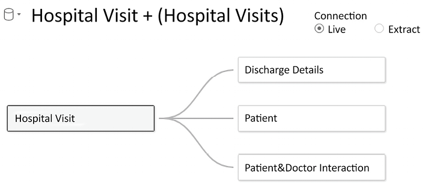
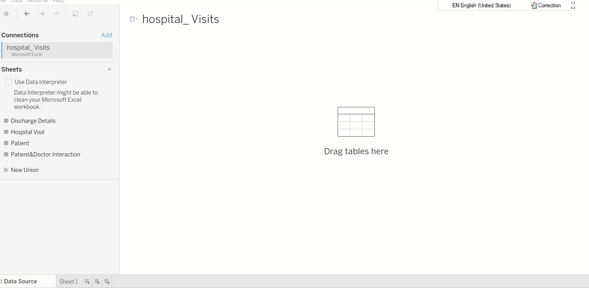
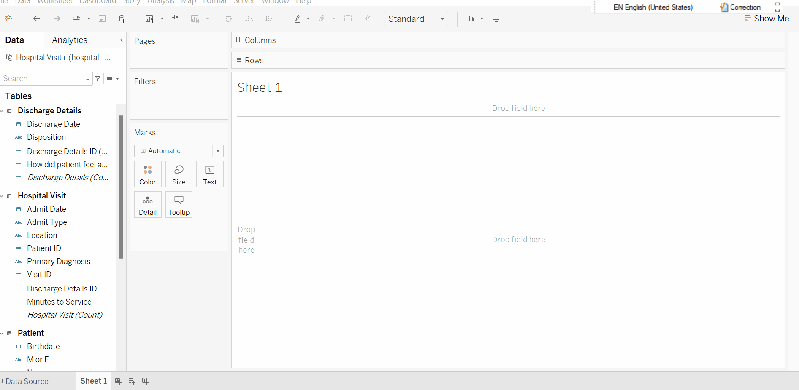
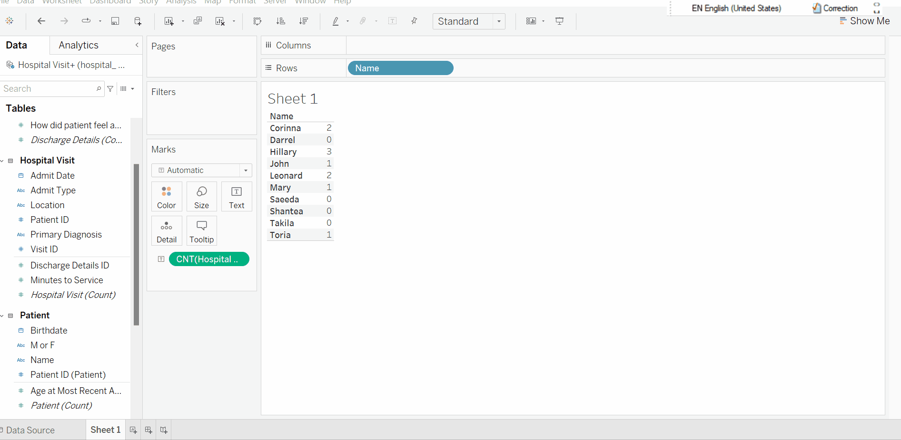
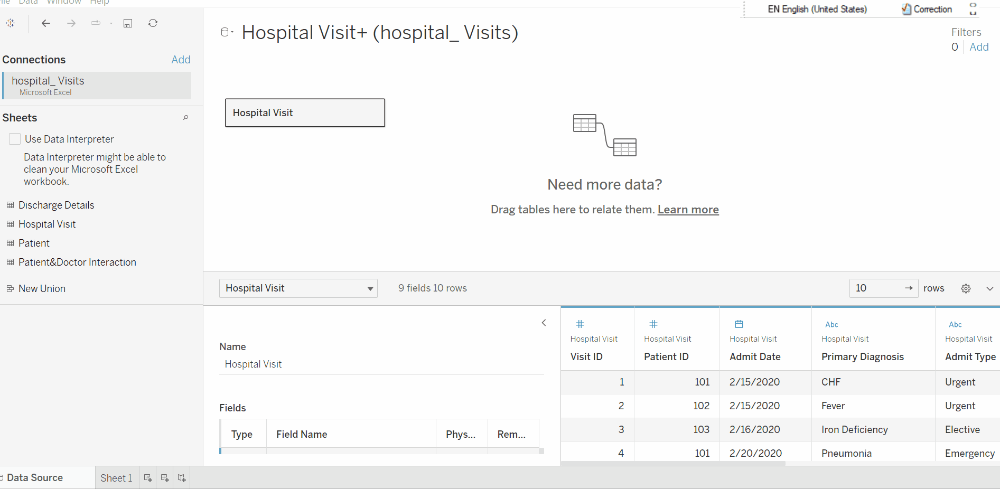
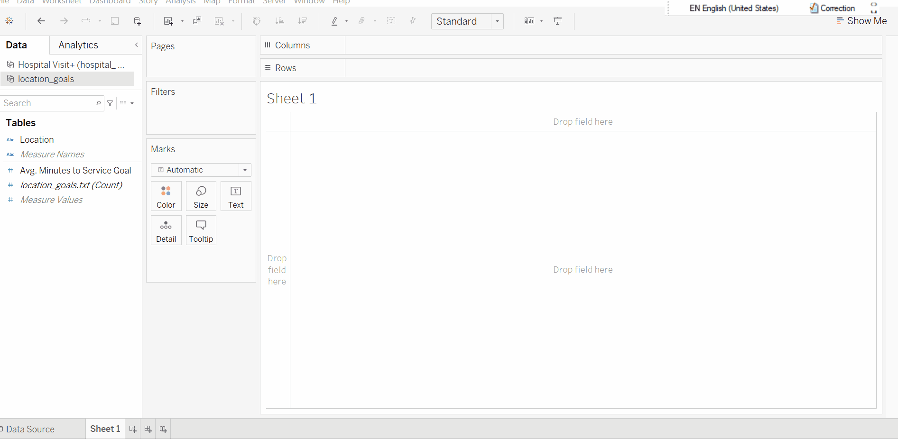

# Dealing with multiple data sources

So far, we have worked with a single table for our analysis. However, we know life is more complex than a single table. In practice, you will be dealing with multiple files, databases with multiple tables, Excel files with multiple tabs, etc. 

 Tableau allows you to relate multiple tables together, either logically or physically.

 To discover these features we will use the [hospital_visits](./data/hospital_%20visits.xlsx) Excel file which contains multiple tables. 

## Combining Data 

There are several ways to combine data, each with their own strengths and weaknesses.

* **Relationships** are the default method and can be used in most instances, including across tables with different levels of detail. Relationships are flexible and adapt to the structure of the analysis on a sheet by sheet basis. However, you can't create relationships between tables from published data sources.

* **Joins** combine tables by adding more columns of data across similar row structures. This can cause data loss or duplication if tables are at different levels of detail, and joins must be established before analysis can begin. You can't use a published data source in a join.

* **Blends**, unlike relationships or joins, never combine the data directly. Instead, blends query each data source independently, aggregate the results to the appropriate level, then present the results together visually in the view. Because of this, blends can handle different levels of detail and also work with published data sources. Blends don't create a new, blended data source (and therefore can't be published as a "blended data source"). Instead, they are simply blended results visualized per sheet.

## Exploring the Tableau data model
 
### Relationships

Every data source you create in Tableau will use the data model. Any time you relate two or more sets of data, you’ll need to give some thought as to the various ways you might relate them in the data model.

It is very similar to how you build a schema for a database. The idea is to think critically about what are the relationships between each table and what are the important keys to related them together. 

Relationships are a dynamic, flexible way to combine data from multiple tables for analysis. You don’t define join types for relationships, so you won’t see a Venn diagram when you create them.

Think of a relationship as a contract between two tables. When you are building a viz with fields from these tables, Tableau brings in data from these tables using that contract to build a query with the appropriate joins.

 For example, in our data (after some exploration) you might want to create a similar structure. </img>

We’ll build the data model by dragging and dropping tables onto the canvas. 

Tableau will suggest relationships for each new table added based on any matching field names and types. 

* We’ll accept the default settings because the `ID` fields that indicate the correct relationship are identically named and typed.
*The first table added is the root and forms the start of the data model. It will be convinient to start with the `Hospital Visits` table as our root. 

 Our data model </img>

## Using the data model

After creating our data model by dragging and dropping the tables and specifying the relationships, we see the effect it has on the data pane. 

You’ll notice that the Data pane is organized by logical tables, with fields belonging to each table. Measures and dimensions are separated by a thin line rather than appearing in different sections as they did previously.

It's always good to do a few checks, to become familiar with the data model. 

1. Drag `Name` from the `Patient` table to Rows reveals 10 patients. We use one or more dimensions from the same logical table, we see the full domain of values in Tableau. That is, we see all the patients, whether or not they had visited the hospital. 

2. We can verify how many visits each patient had by adding the    `Hospital Visit (Count)` field, resulting in the following view:
</img>

3. Drag a second dimension to the Rows, say `Primary Diagnosis`, we see that when you include dimensions from two or more tables, only matching values in both tables are shown. 

 </img>

Take some additional time to build out views and visualizations with the data model you’ve created.

### Using joins

Like with pandas or SQL, joins are an  way to connect together tables of data across various data connections for many different data sources.

Joins are a more static way to combine data. Joins must be defined between physical tables up front, before analysis, and can’t be changed without impacting all sheets using that data source. Joined tables are always merged into a single table. As a result, sometimes joined data is missing unmatched values, or duplicates aggregated values.

The Join dialog allows you to specify the join type (Inner, Left, Right, or Full Outer) and to specify one or more fields on which to join.

4. Going back to our example, let's simplify our data model ot look at some joins. To join to tables double-click on the `Hostpital Visits` table and it will open a join panel. You can then drag the table   `Discharge Details`, and select which type of join to perform. 

 Left join example </img>

All the joins create what you might think of as one flat table, which can be related together with other objects in the data model. Those objects, in turn, might each be made up of a single physical table or multiple physical tables joined together.

## Using blends

Data blending allows you to use data from multiple data sources in the same view. Data blending is done at an aggregate level and involves different queries sent to each data source, unlike joining, which is done at the row level and (conceptually) involves a single query to a single data source. 

Data blending is performed on a sheet-by-sheet basis and is established when a field from a second data source is used in the view.

To create a blend in a workbook, you need to connect to at least two data sources. Then bring a field from one data source to the sheet—it becomes the primary data source. Switch to the other data source and use a field on the same sheet—it becomes a secondary data source. A linking icon will appear in the data pane, indicating which field(s) are being used to blend the data sources.

Let’s look at a quick example of blending in action. Let’s say you have a representing the service goals of various locations throughout the hospital when it comes to serving patients ([locations_goals.txt](./data/location_goals.txt)).

5. Ensure that the workbook has multiple data sources. The second data source should be added by going to `Data` > `New data source`.

Notice that both the `Hospital Visits` data source and the `Location Goals` data source are used in this view. `Hospital Visit` is the primary data source (indicated by a blue checkmark), while `Location Goals` is the secondary source (indicated by the orange checkmark). The `Avg. Minutes to Service Goal`  field on Detail in the Marks card is secondary and also indicated by an icon with an orange checkmark.

## Additional resources

* [How Relationships Differ from Joins](https://help.tableau.com/current/public/desktop/en-us/datasource_relationships_learnmorepage.htm)
* [Blend your Data](https://help.tableau.com/current/public/desktop/en-us/multiple_connections.htm)