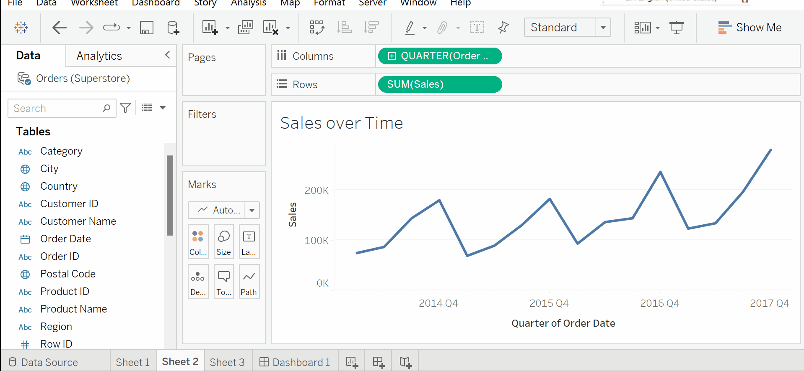
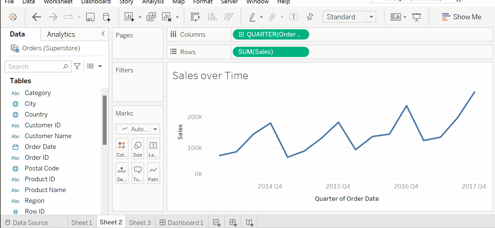
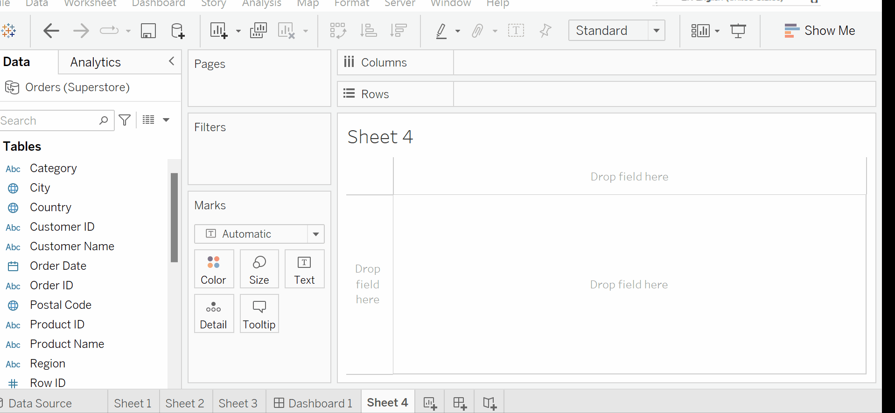

# Visual Analytics: Trends, Clustering, Distributions, and Forecasting

The rapid visual analysis that is possible using Tableau is incredibly useful for answering numerous questions and making key decisions. But it barely scratches the surface of the possible analysis. 

You've already explored some of the main analytics tools we'll see in this section using Python. Let's see how to harness Tableau to go beyond a visualization and into analytics. 

This section will cover some of the built-in statistical models and analysis, including the following topics:

* Trends
* Forecasting
* Clustering

## Trends 

Tableau offers several ways of adding trend lines:

* From the menu, select `Analysis | Trend Lines | Show Trend Lines`.
* Right-click on an empty area in the pane of the view and select `Show Trend Lines`.
* Click on the `Analytics tab` on the left-hand sidebar to switch to the `Analytics pane`. Drag and drop `Trend Line` on the trend model of your choice.

Say, we want to see the trend in `Sales`, with a few clicks we can add a trend line to our visual and even see infomation about the trendline. 

## Forecasting

Trend models make predictions. Given a good model, you expect additional data to follow the trend. When the trend is over time, you can get some idea of where future values may fall. 

However, predicting future values often requires a different type of model. Factors such as seasonality can make a difference not predicted by a trend alone. Tableau includes built-in forecasting models that can be used to predict and visualize future values.

To use forecasting, you’ll need a view that includes a date field or enough date parts for Tableau to reconstruct a date (for example, a Year and a Month field). Tableau also allows forecasting based on integers instead of dates. You may drag and drop a forecast from the Analytics pane, select `Analytics | Forecast | Show Forecast` from the menu, or right-click on the view’s pane and select the option from the context menu.

Much like trends, forecast models and summary information can be accessed using the menu.

Selecting `Analysis | Forecast | Describe Forecast` will display a window with tabs for both the summary and details concerning the model.

## Clustering

Tableau gives you the ability to quickly perform clustering analysis in your visualizations. This allows you to find groups, or clusters, of individual data points that are similar based on any number of your choosing.

Tableau uses a standard `k-means clustering algorithm` that will yield consistent results every time the view is rendered. Tableau will automatically assign the `number of clusters (k)`, but you have the option of adjusting the value as well as assigning any number of variables.

When you drop `Cluster` onto the view, Tableau will generate a new Clusters field (automatically placed on Color here) and will display a `Clusters window` containing the fields used as `Variables` and an option to change the `Number of Clusters`. `Variables` will contain the measures already in the view by default.

## Additional Resources

* [Tableau Forecasting](https://data-flair.training/blogs/tableau-forecasting/)
* [How Forecasting Works in Tableau](https://help.tableau.com/current/pro/desktop/en-us/forecast_how_it_works.htm)
* [Time Series Forecasting: Definition, Applications, and Examples](https://www.tableau.com/learn/articles/time-series-forecasting)
* [Clustering Analysis in Tableau](https://www.datacamp.com/tutorial/cluster-analysis-in-tableau)

We've just covered the basics and there are many more features to explore with Tableau. 

Move on to the chapter to see resources to keep learning!